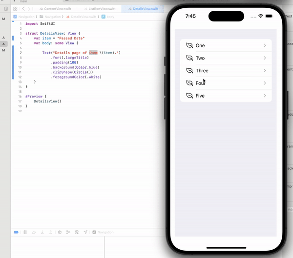

# Dynamic list, Custom Views and NavigationStack in SwiftUI
**Learn how to use NavigationStack in SwiftUI and pass data to the details page. Read the article from [Medium](https://medium.com/p/7cfda15fb7ef).** 

